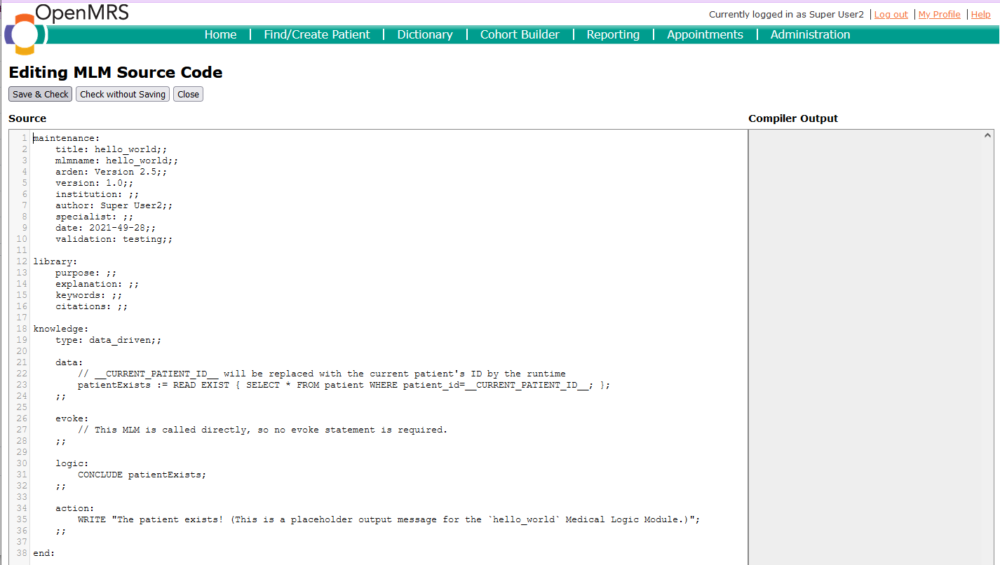

# OpenMRS_edu

The purpose of this repository is to share the scripts, notes, methods, and lessons learned in the process of building an open-source patient record system for education. We are using the [OpenMRS](https://openmrs.org) system as a basis. The reasons for our choice are described in detail in our Medical Informatics Europe conference paper:
> Implementation of an Open-Source Electronic Health Record for Decision-Support Education in Medical Informatics.
> Medlock S, Schermer R, Cornet R. Stud Health Technol Inform. 2020 Jun 16;270:981-985. [https://doi.org/10.3233/shti200308](https://doi.org/10.3233/shti200308)

The current contents include:
* Instructions for getting OpenMRS installed and set up: [OpenMRS_build_instructions](https://github.com/ace-dvm/OpenMRS_edu/blob/master/OpenMRSBuildInstructions.txt)
* Instructions for building copies of [synthetic patients](https://github.com/ace-dvm/OpenMRS_edu/blob/master/syntheticPatients.md)
* [A script](https://github.com/ace-dvm/OpenMRS_edu/blob/master/createOpenmrsminimallabs.sql) for getting the lab metadata imported if the metadata import fails
* You can find our Arden Syntax module here: https://github.com/RSSchermer/openmrs-module-ardenreminders

You may also wish to visit:
* The OpenMRS github: https://github.com/OpenMRS
* The [Arden2ByteCode](http://plri.github.io/arden2bytecode/) github: https://github.com/PLRI/arden2bytecode

## Using OpenMRS for education

OpenMRS is a patient record system developed for use in the clinical setting, particularly in developing countries. It consists of a very small, simple core module with lots of add-on modules available. Almost everything you want to do in OpenMRS can be found in an add-on. Even basic functions like ordering medications are found in add-ons. A list of the add-ons we used can be found in the [OpenMRS_build_instructions](https://github.com/ace-dvm/OpenMRS_edu/blob/master/OpenMRSBuildInstructions.txt).

An advantage of this modular architecture is that it is relatively easy to add functionality. OpenMRS is an open-source system, which means that we as users are free to not only use the software at no cost but also to make changes to the software. We have added one module: The Arden Syntax module, which allows us to add clinical reminders. This adds the "Clinical reminders" section of the record that you see in the screenshot above. 

One of the requirements for this educational program was to add new information to the cases for every day of class, and to give each student their own copy of the case so they could write notes and make other changes to the case. This led to a [process for building copies of synthetic patients](https://github.com/ace-dvm/OpenMRS_edu/blob/master/syntheticPatients.md).

We start with a [detailed written story of the case](https://github.com/ace-dvm/OpenMRS_edu/blob/master/case_description.md), and how it should unfold over time. This case is then entered into OpenMRS, preferably with events entered in the order that they happen in the story:

In some ways, this case is _too_ complete: We want the students to see each day of the story as it unfolds. Also, each student should have their own copy of the case - and since we have about 300 students/year, making a copy by hand is not feasible. Therefore we created [a process for extracting cases into scripts]((https://github.com/ace-dvm/OpenMRS_edu/blob/master/syntheticPatients.md)), that can then be run to create as many copies of the case as needed.

Each student has their own copy of the case, indicated by a prefix to the surname. In this screenshot, we see the copies for the teacher (prefixed by "Docent"). The case for Monday morning (Maandag Ochtend) has the suffix MaO, the one for Tuesday morning (Dinsdag Ochtend) has DiO, and so on.

Each case-day contains only the events that have happened up to that point, so the teacher can ask the students to think about what they would do for the next steps.

If we open up the Monday morning case, we see only the events up 'til Monday morning:

Now the story can unfold as planned.

## Decision support / Arden Syntax
An important feature for our course is the ability for the students to create _decision support_ in the electronic health record.

The Arden Reminders module does exactly that. The module is accessed through the System Administration -> Advanced administration menu:

This opens a menu where the Arden modules can be seen, enabled/disabled, and selected for editing.

Here, MLMs can be edited and compiled. Any data in the database can be used in the logic, making this a rather powerful and flexible tool for creating decision support. It is based on Arden2ByteCode which has a few known bugs, and has not been tested for use in the clinical setting, but for teaching purposes it works quite well.

The [example MLM](https://github.com/ace-dvm/OpenMRS_edu/blob/master/helloworld.mlm) shown here is also included in our repository.

